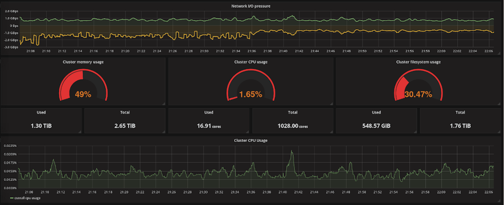
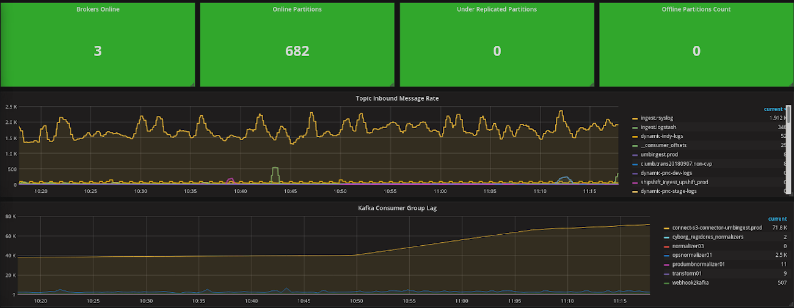

Monitoring
------

The Open Data Hub is a reference architecture running on OpenShift that incorporates a variety of open source projects to function as a ML-as-a-service platform. Given how many different pieces there are in the platform, it is very difficult for devops engineers to get a clear picture of the health of the system. Moreover, it is not possible to make an informed decision regarding hardware requests or SLA’s without understanding how your system is performing. We are addressing this problem by using Prometheus and Grafana as the monitoring solution for the Open Data Hub.



Prometheus
------


[Prometheus](https://prometheus.io/) is an open-source monitoring and alerting tool that was developed at SoundCloud to address the challenges posed by the micro-service oriented architecture they had developed. We were drawn to Prometheus as it offers scalability, easy configurability for targets and alerting, and is simple to run in a variety of different environments. This was especially important to us as any monitoring solution we use should be able to scale out to a large number of instances. In addition to scalably gathering metrics, Prometheus has a powerful query language (imaginatively called PromQL) that makes it easy for the layman to gain insight into the metrics via slicing and various transformations. 

Grafana
------


The front end we are using to visualize these metrics is [Grafana](https://grafana.com/). Grafana has robust integrations in place with data sources such as Prometheus, Elasticsearch, InfluxDB, and Graphite. It also has support for a variety of different types of visualizations both out of the box and through the [grafana-cli](https://grafana.com/docs/administration/cli/). The Grafana community has a large number of dashboards available [here](https://grafana.com/dashboards) which can easily be imported into any running instance of Grafana.

Additional Configuration
------

The monitoring deployment is configured out of the box to scrape ODH spark metrics as well as all pod level metrics that are being exposed on default ports. These metrics can be used to create Grafana dashboards for a quick picture of the health of your system. If your system requires any additional configuration for the alerting or custom endpoints to scrape metrics from, all you need to do is modify the prometheus.yml config map in  prometheus-objects.yaml to add a custom job. A custom job could look something like the following.

```
- job_name: 'My Custom Kafka Metrics'
         metrics_path: '/metrics'
         scheme: http
         static_configs:
           - targets:
             - http://my-custom-kafka-endpoint.com
```
